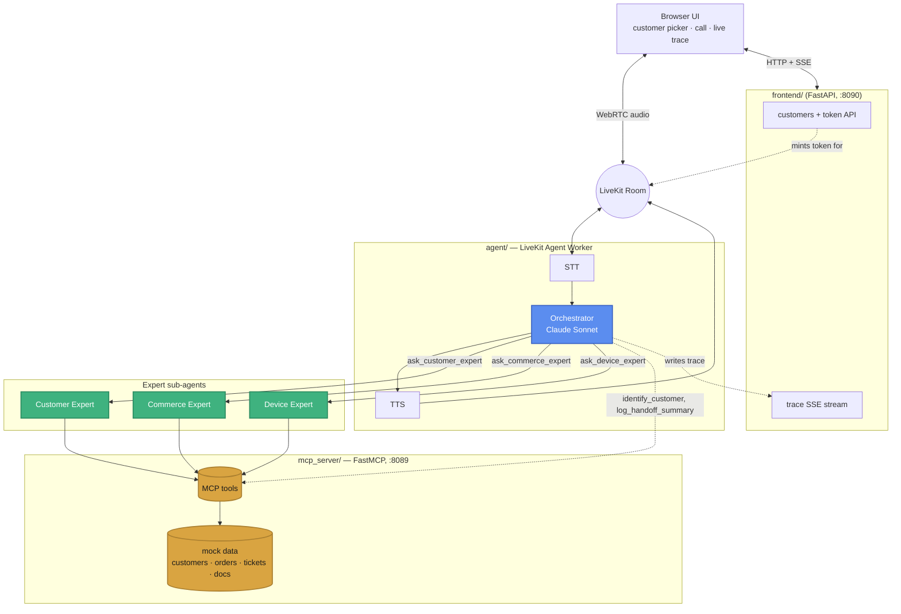

# Nestly Home Voice Support Agent (demo)

A voice-based customer support agent for a fictional smart-home company
(thermostats, cameras, locks, sensors + cloud storage subscription). See
[ARCHITECTURE.md](./ARCHITECTURE.md) for the full design writeup.

## System diagram



The Orchestrator is the only voice/persona on the call. It never sees the
Experts' underlying tools — it hands off a plain-language question and gets
back a synthesized answer, so each Expert independently decides which MCP
tools to call. That delegation boundary is what makes this a real
orchestrator-workers system rather than one agent with a flat tool list.

## Layout

```
agent/
  main.py       LiveKit voice agent (STT -> LLM -> TTS) — the Orchestrator persona
  experts.py    Customer/Commerce/Device expert sub-agents the Orchestrator
                delegates to (each its own Claude/OpenAI tool-use loop)
  mcp_client.py One-off MCP calls used by the Orchestrator's own tools
  tracing.py    Structured trace of every delegation + tool call -> logs/trace.jsonl
mcp_server/     Standalone MCP server exposing customer/commerce/device/handoff
                tools, backed by mock JSON data
frontend/       Demo console: customer picker + start-a-call + live trace, in the browser
scripts/
  view_trace.py Pretty-print / follow logs/trace.jsonl
docker-compose.yml, Dockerfile   Runs all three services together (see Run below)
```

## Setup

1. `cp .env.example .env` and fill in:
   - A LiveKit Cloud project's `LIVEKIT_URL` / `LIVEKIT_API_KEY` / `LIVEKIT_API_SECRET`
     (free tier at [cloud.livekit.io](https://cloud.livekit.io))
   - `ANTHROPIC_API_KEY`, `DEEPGRAM_API_KEY`, `CARTESIA_API_KEY` — or just
     `OPENAI_API_KEY` on its own (STT/LLM/TTS all fall back to OpenAI for
     whichever of the three keys above is missing; see `_select_stt` /
     `_select_llm` / `_select_tts` in `agent/main.py`).
   - `TAVILY_API_KEY` is optional — without it, device web-search
     troubleshooting just reports no results found.
2. If running with Docker Compose, that's the whole setup — skip to
   [Run](#run). Otherwise: `python -m venv .venv && source .venv/bin/activate`
   then `pip install -r requirements.txt`.

## Run

**Docker Compose (recommended)** — one command brings up all three services
(`mcp-server`, `agent`, `frontend`), in the right order (the agent and
frontend wait for the MCP server's healthcheck before starting), sharing a
`./logs` volume so the live trace works across containers:

```bash
docker compose up --build
```

Open **http://localhost:8090**. `docker compose logs -f agent` follows the
voice agent's own logs; `Ctrl-C` (or `docker compose down` from another
terminal) stops everything.

**Without Docker** — three processes, in separate terminals:

```bash
# 1. MCP tool server
python -m mcp_server.server --http --port 8089

# 2. Voice agent worker
python -m agent.main dev

# 3. Demo console (customer picker + call + live trace) — http://localhost:8090
python -m frontend.server
```

Either way: open **http://localhost:8090**, pick a customer in the sidebar (this is
who you'll be "calling as" — their account/devices/orders are shown so you
know what to ask about), click **Start Call**, allow microphone access, and
talk. The right-hand panel shows the Orchestrator's delegations and each
expert's tool calls live as you talk. Picking a customer skips the "what's
your account number" step — the call starts already identified — since the
whole point of the demo console is to let you jump straight to asking
questions.

Prefer the [LiveKit Agents Playground](https://agents-playground.livekit.io)
instead (no customer picker, no live trace panel, but zero setup beyond the
agent worker) — connect to your project and join the room the agent is
listening on; the caller isn't pre-identified there, so ask for identify
yourself with a phone/account number from `mcp_server/data/customers.json`
first.

## Demo script

Try asking (after providing a phone/account number — see
`mcp_server/data/customers.json` for valid test accounts, e.g.
`+15551234567` / `ACC-10234`):

- "What's the status of my most recent order?"
- "Is my thermostat on?" / "What's the temperature in my living room?"
- "My garage sensor keeps going offline, can you help?"
- "Can you transfer me to a person?"

## Testing

There are three independent layers, each testable on its own — you don't
need a live voice call to check that the backend logic works.

**1. Mock data layer** (no server needed):
```bash
python3 -c "
from mcp_server.data import store
print(store.find_customer(phone_number='+15551234567'))
print(store.get_device('ACC-10234', 'SENS-004'))
"
```

**2. MCP server, standalone** — since `mcp_server/` is a normal MCP server,
point at it directly with an MCP inspector (`npx @modelcontextprotocol/inspector
http://localhost:8089/mcp`, after starting the server) or a Claude Desktop
config, independent of the voice pipeline. Or call a tool directly:
```bash
python -m mcp_server.server --http --port 8089 &
python3 -c "
import asyncio
from agent import mcp_client
print(asyncio.run(mcp_client.call_tool('identify_customer', {'account_number': 'ACC-10234'})))
"
```

**3. An expert sub-agent, end to end** (real LLM call + real MCP tool
calls, no voice/LiveKit involved) — this is also the fastest way to see the
multi-agent delegation working:
```bash
python -m mcp_server.server --http --port 8089 &
python3 -c "
import asyncio
from agent.experts import DEVICE_EXPERT, run_expert
print(asyncio.run(run_expert(DEVICE_EXPERT, 'is my garage motion sensor working?', 'ACC-10234')))
"
python scripts/view_trace.py   # see exactly which tools it called, in order
```

**4. Full voice call** — run all three processes from [Run](#run) and open
http://localhost:8090; its live trace panel is the browser equivalent of
`python scripts/view_trace.py --follow`, which still works too and is handy
if you're using the Playground instead.

## Tracing / observability

`agent/tracing.py` writes one JSON line per event to `logs/trace.jsonl`
(plus a console line) covering both the multi-agent orchestration *and* its
latency. The demo console splits these into two panels side by side instead
of one mixed feed, since narrative and timing don't read well interleaved:

**Live trace** (narrative — what happened): `orchestrator.identify_customer`,
`orchestrator.delegate`/`delegate_result`, `orchestrator.handoff`,
`expert.start`, `expert.tool_call` (name/args/result), `expert.answer` — who
was asked what, which tools got called, what came back.

**Latency timeline** (pure timing, rendered as a chronological, left-to-right
lane chart — not just a list of proportional bars): one lane each for STT,
LLM (orchestrator), TTS, turn-taking, LLM (expert), and tool calls.
`metrics.stt` / `metrics.llm` / `metrics.tts` / `metrics.eou` are LiveKit's
own per-component latency for the realtime voice pipeline (forwarded from
`session.on("metrics_collected")`); `expert.llm_call` and `expert.tool_call`
are each individual LLM call and MCP tool call inside an expert's reasoning
loop, timed separately. Every block is positioned at its actual elapsed time
since the first traced event (reconstructed as `ts - duration`, since a step
is only traced once it finishes) and sized proportionally to its duration —
so it reads as an actual growing timeline of the call, not a static list,
and the panel auto-scrolls horizontally to keep the latest activity in view.
This is what answers "is the LLM spending its time reasoning or
tool-calling": the tool-call blocks are a visible sliver next to the
LLM-call blocks (in practice, for this mock backend, ~5-15ms vs.
~800-2500ms — the bottleneck is the model, not the tools).
`expert.tool_call` is the one event that appears in both panels: it's both
a real conversation step and a real timed step.

Note on STT: LiveKit's `STTMetrics.duration` is documented as `0.0` if the
STT is streaming, which Deepgram/OpenAI both are here — that's not a bug,
the field just isn't meaningful for streaming STT. The STT lane uses
`audio_duration_ms` instead (how much speech was captured); `metrics.eou`
(end-of-utterance delay) is the closest available proxy for perceived
STT-related turn-taking latency.

Frontend logic lives in `frontend/static/app.js` (`TIMELINE_EVENTS` /
`TIMELINE_ONLY_EVENTS` / `TIMELINE_LANES`) — both panels read the exact same
SSE stream, they just render different events from it.

View it with:
```bash
python scripts/view_trace.py            # replay everything so far
python scripts/view_trace.py --follow   # tail it live during a call
python scripts/view_trace.py --clear    # wipe it between demo runs
```

`logs/` is git-ignored — it's a runtime artifact, not part of the app.

## Known issue: use headphones when testing

Without headphones, the agent's own TTS played through your speakers can
leak into your mic and get misread as you talking — symptoms: the agent's
voice sounding glitchy/distorted, or the agent repeatedly interrupting
itself and responding to nothing. Browser echo cancellation is on by
default but can't cancel this: it's built for near-instant local loopback,
not the full STT→LLM→TTS round trip a server-side voice agent involves.

`agent/main.py`'s `turn_handling.interruption` config (`mode: "adaptive"`,
`min_words: 2`, `resume_false_interruption`) makes a stray echo blip less
likely to be mistaken for a real interruption and recovers when one slips
through anyway — but headphones are the actual fix, not this.
